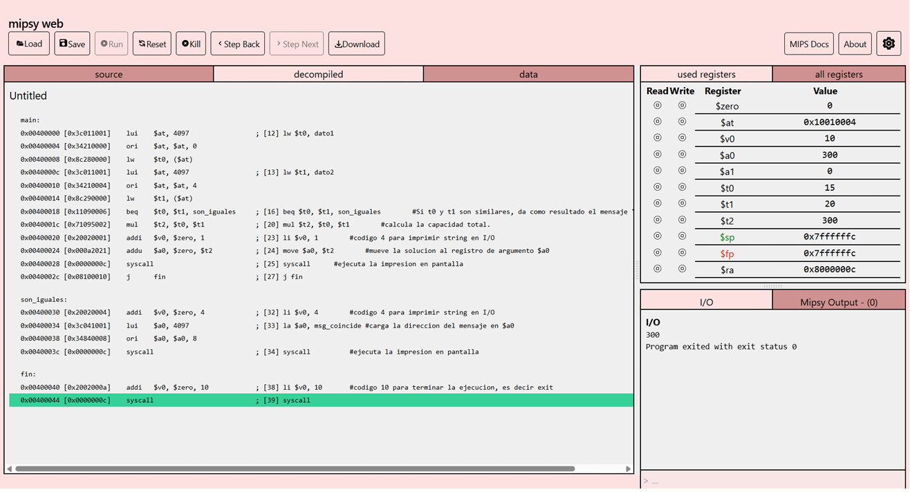
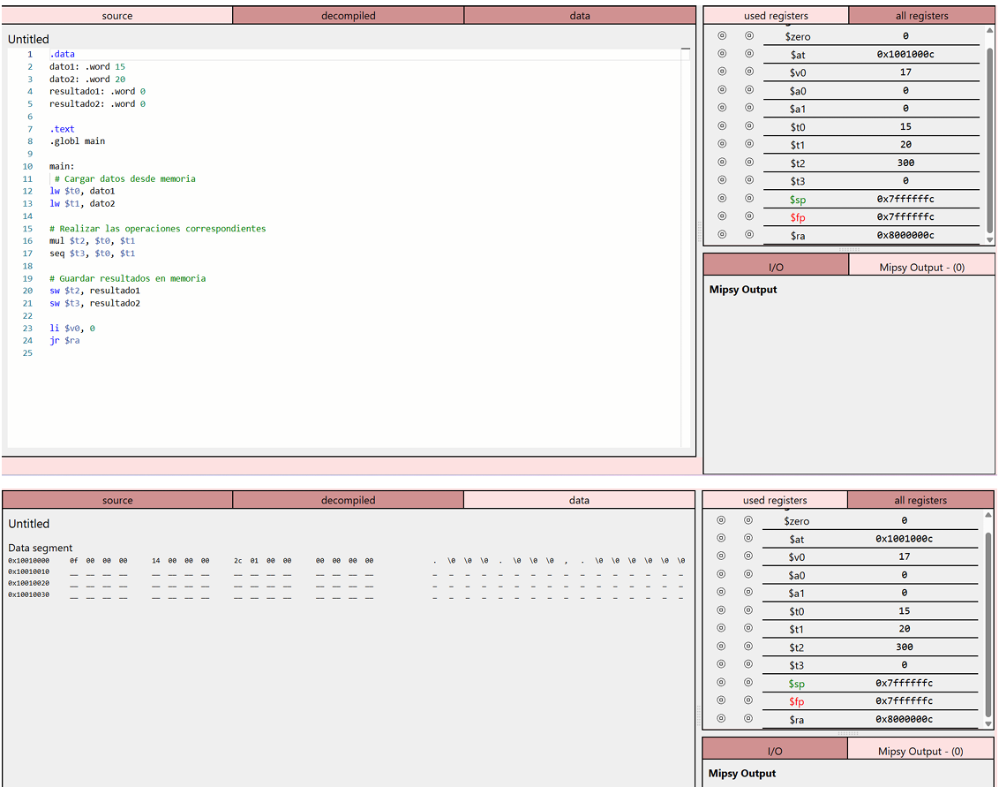

# miniprojecto01

**Asignatura:** Organización y Arquitectura de Computadores  
**Integrantes:** Layedra Jose, Vayas Diego  
**Año:** 2026  
**Fecha:** 8 de octubre de 2026

---

## Descripción

### Escenario

El escenario asignado corresponde a las entradas de un evento. Se conoce el número de filas del recinto (**15**) y la cantidad de asientos por fila (**20**). Se debe calcular la capacidad total del evento y determinar si ambos valores son iguales.

### Resultado

El programa compara las filas con los asientos. Si son iguales, muestra por pantalla el mensaje **"Filas y asientos coinciden"**; en caso contrario, muestra la **capacidad total calculada**. Con los valores asignados (15 y 20) no son iguales, por lo que la consola debe mostrar **300**.

---

## Análisis

### Datos del programa

| Dato | Valor inicial | Propósito |
|---|---:|---|
| `dato1` | 15 | Número de filas del evento |
| `dato2` | 20 | Cantidad de asientos por fila |
| `msg_coincide` | "Filas y asientos coinciden" | Mensaje que se muestra solo si ambos valores son iguales (versión final) |

En la versión base también se reservan `resultado1` y `resultado2`, con valor inicial 0, para guardar la capacidad total (300) y el resultado de la comparación (0, porque no son iguales).

### Operaciones requeridas

| Datos / Resultados | Propósito | Operación requerida | Instrucción MIPS |
|---|---|---|---|
| `dato1` | Cargar dato desde memoria | Carga | `lw` |
| `dato2` | Cargar dato desde memoria | Carga | `lw` |
| Resultado 1 | Capacidad total (filas × asientos) | Multiplicación | `mul` |
| Resultado 2 | Saber si filas y asientos son iguales | Comparación | `seq` (base), `beq` (final) |
| Resultado 3 | Mostrar el resultado por pantalla | Impresión | `syscall` |
| Resultado final | Guardar resultados en memoria (versión base) | Almacenamiento | `sw` |

---

## Implementación

### Versión base

La carpeta `version_base/` contiene el programa del primer avance.

**Archivo:**

```text
version_base/programa_base.s
```

El programa carga `dato1` y `dato2` con `lw`, calcula la capacidad total con `mul` (300) y compara ambos valores con `seq` (0, porque no son iguales). Finalmente guarda los dos resultados en memoria con `sw`. En este estado el programa aún no muestra nada por pantalla.

### Versión final

La carpeta `version_final/` contiene el programa desarrollado por el grupo.

**Archivo:**

```text
version_final/programa_final.s
```

La versión final:

- Carga los datos almacenados en memoria con `lw`.
- Compara filas y asientos con `beq`, que salta a `son_iguales` si los valores coinciden.
- Si no coinciden, calcula la capacidad total con `mul` y la imprime con `syscall` (código 1).
- Si coinciden, imprime el mensaje de `msg_coincide` con `syscall` (código 4).
- Termina el programa con `syscall` (código 10).
- Incluye comentarios explicativos dentro del código.

---

## Evidencias de ejecución

### Código



**Descripción:**  
Código del programa cargado en el simulador Mipsy, con la sección `.data` (filas, asientos y mensaje) y la sección `.text` con la carga, la comparación con `beq`, la multiplicación y las llamadas al sistema.

### Registros


**Descripción:**  
Al terminar la ejecución, `$t0` vale 15 (filas), `$t1` vale 20 (asientos), `$t2` vale 300 (capacidad total) y `$a0` vale 300 (valor enviado a imprimir). `$v0` vale 10, el código de salida del programa.

### Resultado



**Descripción:**  
La consola I/O muestra **300**, la capacidad total del evento, porque 15 filas y 20 asientos no son iguales. Después aparece el aviso de que el programa terminó con estado 0.

---

## Conclusiones

Este avance nos permitió ver cómo un cambio pequeño en el enunciado obliga a replantear la forma de pensar la solución, y nos ayudó a razonar el programa paso a paso en lugar de solo escribirlo. Ejecutarlo en el simulador y revisar los resultados nos dio seguridad para comprobar por nuestra cuenta si lo que esperábamos coincidía con lo que ocurría.

También aprendimos la importancia de comentar bien el código y de revisar los detalles antes de entregar, y que trabajar en pareja ayuda a detectar errores que de forma individual se pasan por alto.

---

## Documentación

El reporte completo del proyecto está en formato PDF en:

```text
documentacion/reporte_proyecto.pdf
```

---

## Estructura del repositorio

```text
miniproyecto01/
│
├── README.md
│
├── version_base/
│   └── programa_base.s
│
├── version_final/
│   └── programa_final.s
│
├── evidencias/
│   ├── evidencia1.png
│   └── evidencia2.png
│
└── documentacion/
    └── reporte_proyecto.pdf
```

---

## Bibliografía

Patterson, D. A., & Hennessy, J. L. (2021). *Computer organization and design MIPS edition: The hardware/software interface* (6th ed.). Morgan Kaufmann.
